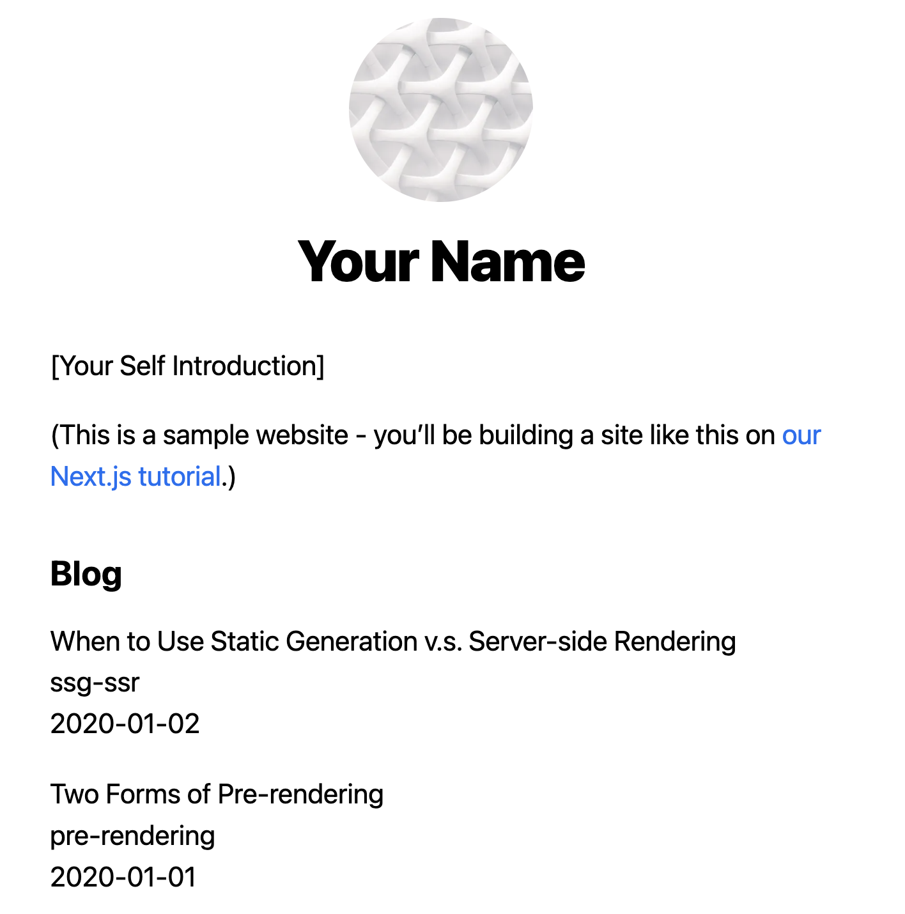

This is a starter template for [Learn Next.js](https://nextjs.org/learn).

## Create project

```
npx create-next-app@latest nextjs-training --use-npm --example "https://github.com/vercel/next-learn/tree/master/basics/learn-starter"
```

## Run

Development:
```
npm run start:server
```
Production:
```
npm run build
npm run prod
```



## Profiling


## Development

1. Tutorial
    1. [Page with Link](docs/01-page-with-link.md): https://nextjs.org/learn/basics/navigate-between-pages
    1. [Assets, Metadata, and CSS](docs/02-assets-metadata-css.md): https://nextjs.org/learn/basics/assets-metadata-css
    1. [Pre-rendering and Data Fetching](docs/03-prerendering-and-data-fetching.md): https://nextjs.org/learn/basics/data-fetching
1. Other
    1. [Open Telemetry](docs/10-opentelemetry.md)
