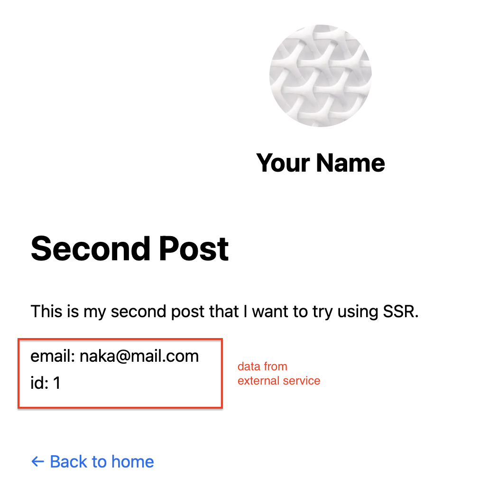

# SSR

1. Create second post page

    ```js
    import Head from 'next/head';
    import utilStyles from '../../styles/utils.module.css';
    import Layout from '../../components/layout';


    export async function getServerSideProps() {
        // run https://github.com/nakamasato/fastapi-sample on your local
        try {
            const res = await fetch(`http://localhost:8000/users/?skip=0&limit=100`)
            const data = await res.json()
            return { props: { data } }
        } catch {
            // if it fails, return the static data
            console.log("Please run https://github.com/nakamasato/fastapi-sample in your local")
            const data = [{ "email": "test@mail.com", "id": 1, "is_active": true }]
            return { props: { data }}
        }
    }


    export default function SecondPost({ data }) {
        return (
            <Layout>
                <Head>
                    <title>Second Post</title>
                </Head>
                <h1>Second Post</h1>
                <p>This is my second post that I want to try using SSR.</p>
                <ul className={utilStyles.list}>
                    {data.map(({ id, email }) => (
                        <li className={utilStyles.listItem} key={id}>
                            email: {email}
                            <br />
                            id: {id}
                        </li>
                    ))}
                </ul>
            </Layout>
        );
    }
    ```
1. Add a link in index page.
    ```js
        <p>
          I&apos;m also working on <Link href="/posts/second-post-ssr">second post with SSR</Link>
        </p>
    ```
1. Run external service
    ```
    git clone git@github.com:nakamasato/fastapi-sample.git && cd fastapi-sample
    docker compose up
    ```
    Create a record in the API

    ```
    curl -X 'POST' \
    'http://localhost:8000/users/' \
    -H 'accept: application/json' \
    -H 'Content-Type: application/json' \
    -d '{
    "email": "naka@mail.com",
    "password": "password"
    }'
    ```
1. Run the app
    ```
    npm run start:server
    ```
1. Open second page
    
