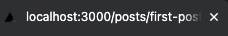
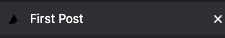
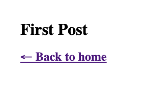
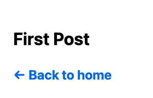

This is a starter template for [Learn Next.js](https://nextjs.org/learn).

## Run

```
yarn start:server
```

## Development

### [Page with Link](https://nextjs.org/learn/basics/navigate-between-pages)

1. Add page: [pages/posts/first-post.js](pages/posts/first-post.js)
    ```js
    export default function FirstPost() {
      return <h1>First Post</h1>;
    }
    ```

    http://localhost:3000/posts/first-post
1. `Link` component
    ```js
    import Link from 'next/link';
    ...
    <h1 className={styles.title}>
      Read <Link href="/posts/first-post">this page!</Link>
    </h1>
    ```

### [Assets, Metadata, and CSS](https://nextjs.org/learn/basics/assets-metadata-css)

[static file serving](https://nextjs.org/docs/basic-features/static-file-serving)
Image:
1. Put image file under **public/images**: [public/images/profile.jpg](public/images/profile.jpg)
1. **Image Component** with [next/image](https://nextjs.org/docs/api-reference/next/image) extension.
    > Images are lazy loaded by default. That means your page speed isn't penalized for images outside the viewport. Images load as they are scrolled into viewport.

Head:
1. Use `<Head>` component from [next/head](https://nextjs.org/docs/api-reference/next/head) module.
1. Add the following code to `pages/posts/first-post.js`:

    ```js
    import Head from 'next/head';

    export default function FirstPost() {
      return (
        <>
          <Head>
            <title>First Post</title>
          </Head>
          <h1>First Post</h1>
          <h2>
            <Link href="/">← Back to home</Link>
          </h2>
        </>
      );
    }
    ```
1. You can see `First Post` in the browser tab.
    - before:
        
    - after:
        

Script:
1. Use `<Script>` component for more detailed configuration for third-party script loading. e.g. LazyLoading

CSS: https://nextjs.org/learn/basics/assets-metadata-css/layout-component

CSS Module locally scopes CSS at the component-level by automatically creating unique class names.

Layout:

1. Create `Layout Component` in `components/layout.js`

    ```js
    export default function Layout({ children }) {
        return <div>{children}</div>;
    }
    ```
1. Update `pages/posts/first-post.js`
    ```js
    import Head from 'next/head';
    import Link from 'next/link';
    import Layout from '../../components/layout';


    export default function FirstPost() {
        return (
            <Layout>
                <Head>
                    <title>First Post</title>
                </Head>
                <h1>First Post</h1>
                <h2>
                    <Link href="/">← Back to home</Link>
                </h2>
            </Layout>
        );
    }
    ```
1. Add CSS `components/layout.module.css`
    ```css
    .container {
      max-width: 36rem;
      padding: 0 1rem;
      margin: 3rem auto 6rem;
    }
    ```
1. Use the css in `components/layout.js`
    ```js
    import styles from './layout.module.css';

    export default function Layout({ children }) {
        return <div className={styles.container}>{children}</div>;
    }
    ```

1. Run
    ```
    npm run dev
    ```

    

Global CSS:

1. pages/_app.js

    ```js
    export default function App({ Component, pageProps }) {
      return <Component {...pageProps} />;
    }
    ```

    [pages/_app.js](https://nextjs.org/docs/advanced-features/custom-app)

1. global css with `styles/globals.css` (already exists)

    ```css
    html,
    body {
      padding: 0;
      margin: 0;
      font-family: -apple-system, BlinkMacSystemFont, Segoe UI, Roboto, Oxygen, Ubuntu,
        Cantarell, Fira Sans, Droid Sans, Helvetica Neue, sans-serif;
      line-height: 1.6;
      font-size: 18px;
    }

    * {
      box-sizing: border-box;
    }

    a {
      color: #0070f3;
      text-decoration: none;
    }

    a:hover {
      text-decoration: underline;
    }

    img {
      max-width: 100%;
      display: block;
    }
    ```
1. Import in `pages/_app.js`

    ```js
    import '../styles/globals.css';

    export default function App({ Component, pageProps }) {
        return <Component {...pageProps} />;
    }
    ```
1. Run
    ```
    npm run dev
    ```

    


[Polishing Style](https://nextjs.org/learn/basics/assets-metadata-css/polishing-layout):

1. Update components/layout.module.css
1. Create styles/utils.module.css
1. Update components/layout.js
1. Update pages/index.js

## Other Contents

1. [Open Telemetry](docs/02-opentelemetry.md)
