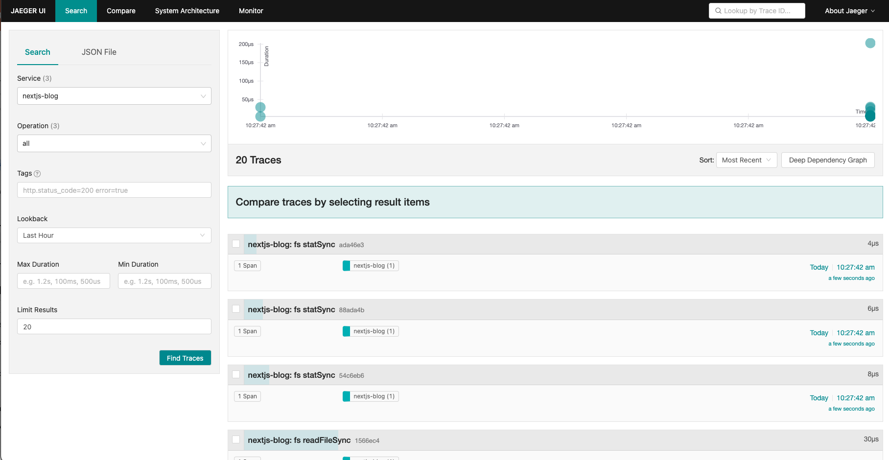
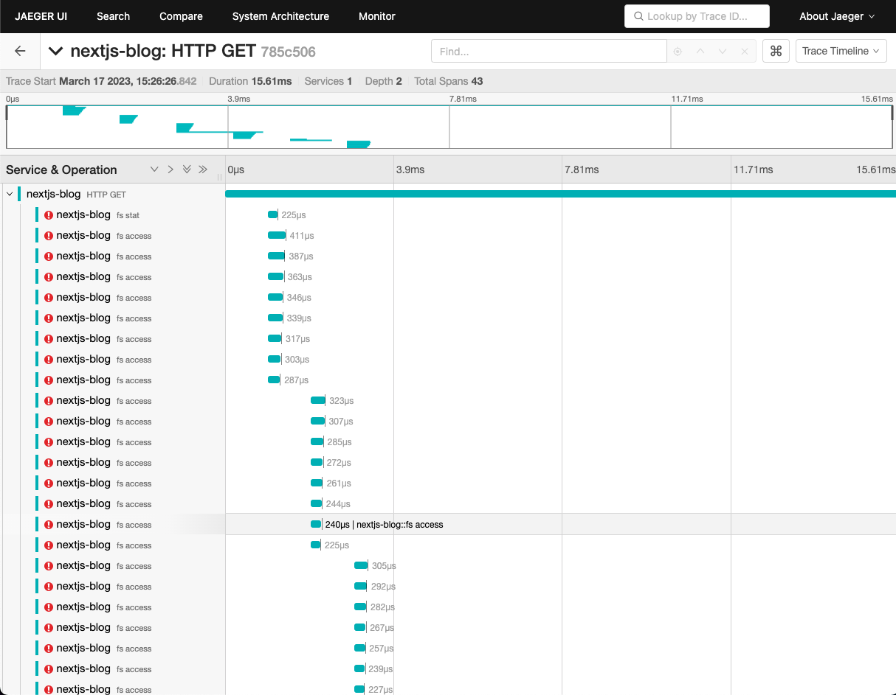
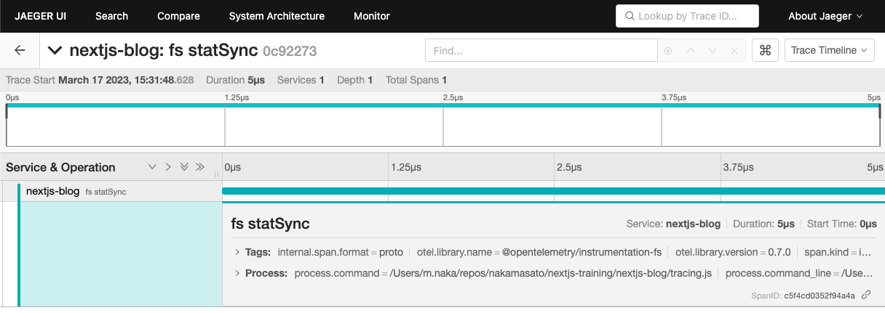

# [Opentelemetry](https://signoz.io/blog/opentelemetry-nextjs/)

## Jaeger

1. Run jaeger with Docker
    ```
    docker run -d --name jaeger \
      -e COLLECTOR_ZIPKIN_HOST_PORT=:9411 \
      -e COLLECTOR_OTLP_ENABLED=true \
      -p 6831:6831/udp \
      -p 6832:6832/udp \
      -p 5778:5778 \
      -p 16686:16686 \
      -p 4317:4317 \
      -p 4318:4318 \
      -p 14250:14250 \
      -p 14268:14268 \
      -p 14269:14269 \
      -p 9411:9411 \
      jaegertracing/all-in-one:latest
    ```
1. install packages
    ```
    npm i @opentelemetry/sdk-node
    npm i @opentelemetry/auto-instrumentations-node
    npm i @opentelemetry/exporter-trace-otlp-http
    npm i @opentelemetry/resources
    npm i @opentelemetry/semantic-conventions
    npm i @opentelemetry/exporter-jaeger
    ```
1. add `tracing.js` and `server.js`

    `tracing.js`:

    ```js
    'use strict'

    const opentelemetry = require('@opentelemetry/sdk-node');
    const { getNodeAutoInstrumentations } = require('@opentelemetry/auto-instrumentations-node');
    const { JaegerExporter } = require('@opentelemetry/exporter-jaeger');


    const { Resource } = require('@opentelemetry/resources');
    const { SemanticResourceAttributes } = require('@opentelemetry/semantic-conventions');

    // custom nextjs server
    const { startServer } = require('./server');

    const exporterOptions = {
        endpoint: 'http://localhost:14268/api/traces',
    }
    const traceExporter = new JaegerExporter(exporterOptions);
    const sdk = new opentelemetry.NodeSDK({
        resource: new Resource({
            [SemanticResourceAttributes.SERVICE_NAME]: 'nextjs-blog'
        }),
        traceExporter,
        instrumentations: [getNodeAutoInstrumentations()]
    });

    // initialize the SDK and register with the OpenTelemetry API
    // this enables the API to record telemetry
    sdk.start()
        .then(() => console.log('Tracing initialized'))
        .then(() => startServer())
        .catch((error) => console.log('Error initializing tracing', error));

    // gracefully shut down the SDK on process exit
    process.on('SIGTERM', () => {
        sdk.shutdown()
            .then(() => console.log('Tracing terminated'))
            .catch((error) => console.log('Error terminating tracing', error))
            .finally(() => process.exit(0));
    });

    module.exports = sdk
    ```

    `server.js`:

    ```js
    const { createServer } = require("http")
    const { parse } = require("url")
    const next = require("next")

    const dev = process.env.NODE_ENV !== "production"
    const app = next({ dev })
    const handle = app.getRequestHandler()

    module.exports = {
        startServer: async function startServer() {
            return app.prepare().then(() => {
                createServer((req, res) => {
                    const parsedUrl = parse(req.url, true)
                    handle(req, res, parsedUrl)
                }).listen(3000, (err) => {
                    if (err) throw err
                    console.log("> Ready on http://localhost:3000")
                })
            })
        },
    }
    ```

1. package.json
    ```
    yarn start:server
    ```
    or

    ```
    npm run start:server
    ```
1. Open app on http://localhost:3000
1. Check on http://localhost:16686/

    

## otel-collector + jaeger

1. Create Docker network
    ```
    docker network create otlp
    ```
1. Start jaeger

    ```
    docker run -d --name jaeger \
      --network=otlp \
      -e COLLECTOR_ZIPKIN_HOST_PORT=:9411 \
      -e COLLECTOR_OTLP_ENABLED=true \
      -p 16686:16686 \
      -p 14250:14250 \
      jaegertracing/all-in-one:latest
    ```
1. prepare otel collector `otel-collector-config.docker.yaml`

    ```yaml
    receivers:
      otlp:
        protocols:
          grpc:
            endpoint: "0.0.0.0:4317"

    processors:

    exporters:
      jaeger:
        endpoint: jaeger:14250
        tls:
          insecure: true

    service:
      pipelines:
        traces:
          receivers: [otlp]
          processors: []
          exporters: [jaeger]
      telemetry:
        logs:
          level: debug
    ```
1. start otel-collector

    ```
    docker run -d --name otel-collector \
      --network=otlp \
      -p 4318:4318 \
      -v $(pwd)/otel-collector-config.docker.yaml:/config.yaml:z \
      otel/opentelemetry-collector-contrib:0.59.0 \
      --config=/config.yaml
    ```
1. Update `tracing.js` (Change `JaegerTracer` to `OltpTracer`)

    ```diff
    +++ b/nextjs-blog/tracing.js
    @@ -3,7 +3,6 @@
     const opentelemetry = require('@opentelemetry/sdk-node');
     const { getNodeAutoInstrumentations } = require('@opentelemetry/auto-instrumentations-node');
    +const { OTLPTraceExporter } = require('@opentelemetry/exporter-trace-otlp-http');
    -const { JaegerExporter } = require('@opentelemetry/exporter-jaeger');


     const { Resource } = require('@opentelemetry/resources');
    @@ -12,10 +11,9 @@ const { SemanticResourceAttributes } = require('@opentelemetry/semantic-conventi
     // custom nextjs server
     const { startServer } = require('./server');

    -const exporterOptions = {
    -    endpoint: 'http://localhost:14268/api/traces',
    -}
    -const traceExporter = new JaegerExporter(exporterOptions);
    +const traceExporter = new OTLPTraceExporter({
    +    url: 'http://localhost:4318/v1/traces'
    +});
    ```

    <details>

    ```js
    'use strict'

    const opentelemetry = require('@opentelemetry/sdk-node');
    const { getNodeAutoInstrumentations } = require('@opentelemetry/auto-instrumentations-node');
    const { OTLPTraceExporter } = require('@opentelemetry/exporter-trace-otlp-http');


    const { Resource } = require('@opentelemetry/resources');
    const { SemanticResourceAttributes } = require('@opentelemetry/semantic-conventions');

    // custom nextjs server
    const { startServer } = require('./server');

    const traceExporter = new OTLPTraceExporter({
        url: 'http://localhost:4318/v1/traces'
    });
    const sdk = new opentelemetry.NodeSDK({
        resource: new Resource({
            [SemanticResourceAttributes.SERVICE_NAME]: 'nextjs-blog'
        }),
        traceExporter,
        instrumentations: [getNodeAutoInstrumentations()]
    });

    // initialize the SDK and register with the OpenTelemetry API
    // this enables the API to record telemetry
    sdk.start()
        .then(() => console.log('Tracing initialized'))
        .then(() => startServer())
        .catch((error) => console.log('Error initializing tracing', error));

    // gracefully shut down the SDK on process exit
    process.on('SIGTERM', () => {
        sdk.shutdown()
            .then(() => console.log('Tracing terminated'))
            .catch((error) => console.log('Error terminating tracing', error))
            .finally(() => process.exit(0));
    });

    module.exports = sdk
    ```

    </details>

1. Run
    ```
    npm run start:server
    ```
1. Open http://localhost:3000/posts/first-post
1. Check Jaeger http://localhost:16686/search
    


Tips:

1. Install tracing
    ```
    npm install --save @opentelemetry/tracing
    ```
1. Import
    ```js
    const {
        BasicTracerProvider,
        ConsoleSpanExporter,
        SimpleSpanProcessor,
    } = require("@opentelemetry/tracing");
    ```
1. Use ConsoleSpanExporter and SimpleSpanProcessor
    ```js
    const provider = new BasicTracerProvider({
        resource: new Resource({
            [SemanticResourceAttributes.SERVICE_NAME]:
                "nextjs-block",
        }),
    });
    // export spans to console (useful for debugging)
    provider.addSpanProcessor(new SimpleSpanProcessor(new ConsoleSpanExporter()));
    // export spans to opentelemetry collector
    provider.addSpanProcessor(new SimpleSpanProcessor(exporter));
    ```
1. Run

    ```
    npm run start:server
    ```
1. http://localhost:3000/posts/first-post
1. Check on Jaeger
    
1. Cleanup

    ```
    docker rm -f jaeger
    docker rm -f otel-collector
    docker network rm otlp
    ```
Ref:
1. https://opentelemetry.io/docs/instrumentation/js/getting-started/nodejs/
1. https://logz.io/blog/nodejs-javascript-opentelemetry-auto-instrumentation/#jaeger
